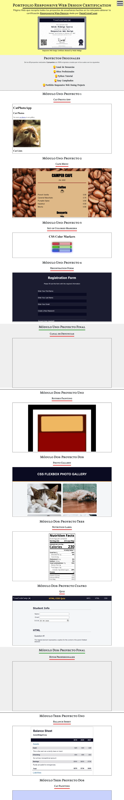

Este repositorio contiene el código de **TODOS** los proyectos realizados para obtener la certificación Resposive Web Design dada por Freecodecamp. En total son 20 proyectos siendo 15 proyectos guiados y **5 proyectos originales**. Sumando cada paso o ejercicio al realizar los proyectos guiados se obtiene un total de **1035 ejercicios** tomándome alrededor de **50 días** en terminarlos por completo incluidos los proyectos finales. La certificación se puede ver directo en freecodecamp en el siguiente [link](https://www.freecodecamp.org/certification/waldo-hidalgo/responsive-web-design)

Se me ha generado el siguiente certificado:

Las tecnologías que he utilizando fueron las siguientes:

Junto con las siguientes librerías:

1-Fancybox para el lightbox del certificado

2-ScrollReveal para las animaciones de entrada de los contenedores de iframes

En el proyecto final he querido colocar todos los proyectos realizados para obtener la certificación y un screenshot del proyecto es el siguiente:

Un listado del nombre de cada proyecto lo muestro a continuación:

#### Módulo 1

1-Learn HTML by Building a **Cat Photo App**

2-Learn Basic CSS by Building a **Cafe Menu**

3-Learn CSS Colors by Building a Set of **Colored Markers**

4-Learn HTML Forms by Building a **Registration Form**

5-Survey Form: Proyecto 100% Original **Canal de Denuncias**

#### Módulo 2

1-Learn the CSS Box Model by Building a **Rothko Painting**

2-Learn CSS Flexbox by Building a **Photo Gallery**

3-Learn Typography by Building a **Nutrition Label**

4-Learn Accessibility by Building a **Quiz**

5-Tribute Page: Proyecto 100% Original**Hitos Profesionales**

#### Módulo 3

1-Learn More About CSS Pseudo Selectors by Building A **Balance Sheet**

2-Learn Intermediate CSS by Building a **Cat Painting**

3-Learn Responsive Web Design by Building a **Piano**

4-Technical Documentation Page: Proyecto 100% Original **Python Tutorial**

#### Módulo 4

1-Learn CSS Variables by Building a **City Skyline**

2-Learn CSS Grid by Building a **Magazine**

3-Product Landing Page: Proyecto 100% Original **Easy Cumpleaños**

#### Módulo 5

1-Learn CSS Animation by Building a **Ferris Wheel**

2-Learn CSS Transforms by Building a **Penguin**

3-Personal Portfolio Webpage: Proyecto 100% Original **Recopilatorio Proyectos Certificación Responsive Web Desing de Freecodecamp**
